# Google Smart Home API: Planter and Mailbox

**Disclaimer:** THESE INSTRUCTIONS ARE BEING PROVIDED FOR INFORMATIONAL PURPOSES ONLY AND ARE NOT INTENDED TO BE USED FOR THE PRODUCTION OF COMMERCIAL PRODUCTS.  BY EXECUTING THESE INSTRUCTIONS, YOU AGREE TO ASSUME ALL LIABILITY IN CONNECTION WITH YOUR BUILDING AND USE OF ANY DEVICE. DEEPLOCAL DISCLAIMS ALL WARRANTIES EXPRESS OR IMPLIED WITH RESPECT TO THESE INSTRUCTIONS AND ANY RESULTING DEVICE INCLUDING BUT NOT LIMITED TO WARRANTIES FOR MERCHANTABILITY, FITNESS FOR ANY PARTICULAR PURPOSE, AND NON-INFRINGEMENT.  YOU SHOULD USE EXTREME CAUTION WHEN BUILDING AND USING ANY DEVICE PURSUANT TO THESE INSTRUCTIONS.  IN NO EVENT SHALL DEEPLOCAL BE LIABLE FOR ANY CLAIM OR DAMAGES, INCLUDING BUT NOT LIMITED TO CLAIMS OR DAMAGES RELATED TO DEATH OR PERSONAL INJURY, PROPERTY DAMAGE, OR PRODUCT LIABILITY.

<!-- TOC -->

- [Google Smart Home API: Planter and Mailbox](#google-smart-home-api-planter-and-mailbox)
    - [Building the Planter](#building-the-planter-what-youll-need)
        - [Tools](#tools)
        - [Materials](#materials)
        - [Warnings](#warnings)
        - [Planter Assembly](#planter-assembly)
    - [Building the Mailbox](#building-the-mailbox-what-youll-need)
        - [Tools](#tools-1)
        - [Materials](#materials-1)
        - [Warnings](#warnings-1)
        - [Mailbox Assembly](#mailbox-assembly)
    - [Smart Home Programming](#smart-home-programming-overview-how-do-we-control-a-mailbox-and-planter-assistant-services-and-the-home-graph-api)
    
<!-- /TOC -->

## Building the Planter: What You'll Need

### Tools
* Soldering Iron + Solder
* Wire Strippers
* Screwdriver Set
* Wrench Set
* Drill

### Materials

| Part                                                                            | Qty | Total   |
| --------------------------------------------------------------------------------|:----| -------:|
| [Raspberry Pi 3 CanaKit](https://www.amazon.com/gp/product/B01C6EQNNK/)         | 1   | $49.99  |
| [Extension Cable](https://www.amazon.com/gp/product/B00178HJ6C/)                | 1   | $5.79   |
| [USB Speakers](https://www.amazon.com/gp/product/B00GHY5F3K/)                   | 1   | $12.98  |
| [Beefcake Relay Kit](https://www.sparkfun.com/products/13815)                   | 4   | $31.80  |
| [Terminal Strip](https://www.amazon.com/gp/product/B01N3AJOYK/)                 | 2   | $10.49  |
| [16 AWG Wire](https://www.amazon.com/gp/product/B0746HRVZP/)                    | 1   | $8.80   |
| [22 AWG Wire](https://www.amazon.com/gp/product/B00B4ZQ3L0/)                    | 1   | $17.95  |
| [Light Bulb Socket ](https://www.amazon.com/gp/product/B000HJ97AS/)             | 6   | $7.68   |
| [Grow Bulbs](https://www.amazon.com/gp/product/B01NCVWFUE/)                     | 6   | $119.94 |
| [3.5 Gal Bucket](https://www.amazon.com/gp/product/B009GK2SN2/)                 | 1   | $13.43  |
| [Hose, ½” ID](https://www.mcmaster.com/#5633k24/=1cvaaim)                       | 1   | $15.80  |
| [Water Pump](https://www.amazon.com/gp/product/B071Z75WYM/)                     | 1   | $98.99  |
| [Hose Clamp, 3/4"](https://www.mcmaster.com/#5388k17/=1cvah8f)                  | 2   | $6.61   |
| [Barb Fitting, 1/2" ID to 1/4-NPT](https://www.mcmaster.com/#5346k37/=1cvaffv)  | 1   | $11.75  |
| [Teflon Tape](https://www.amazon.com/gp/product/B00ITPHXZI/)                    | 1   | $4.86   |
| [Push Connect Fittings](https://www.amazon.com/gp/product/B00AXAY47W/)          | 6   | $16.49  |
| [1/4” OD tubing](https://www.amazon.com/gp/product/B071D9G3YP/)                 | 1   | $8.99   |
| [Manual Shutoff Valve](https://www.amazon.com/gp/product/B012DIW9YG/)           | 1   | $6.99   |
| [Water Filter](https://www.amazon.com/gp/product/B01M68KRIK/)                   | 1   | $17.90  |
| [Electric Valve](https://www.mcmaster.com/#5489t411/=1cva9nx)                   | 1   | $73.30  |
| [1/4 NPT female Tee](https://www.mcmaster.com/#50785k72/=1cvaato)               | 1   | $6.00   |
| [1/4 NPT female Elbow](https://www.mcmaster.com/#50785k36/=1cvbnmo)             | 2   | $8.08   |
| [#10 to 1/4 NPT female female adapter](https://www.mcmaster.com/#5454k54/=1cvapa1) | 2 | $12.28 |
| [Nozzles](https://www.amazon.com/gp/product/B01K40RFFI/)                        | 2   | $9.99   |
| [Potting Soil / Pebbles](https://www.amazon.com/gp/product/B009LNOZQ2/)         | 1   | $12.19  |
| [Plastic Bin](https://www.walmart.com/ip/Sterilite-8-Qt-7-6-L-Dishpan-White/45942067) | 3 | $6.00 |

### Warnings
* This project involves high-voltage wiring (mains 110V). Take appropriate safety precautions when working with mains voltage, and ensure that everything is unplugged before touching electrical connections.
* This project also involves moderately pressurized water.  Use appropriate sealing strategies on all joints, and always leak-test before installing.
* Most importantly - water and electricity can be dangerous in combination. Plan your electrical layout so there is no possibility of leaking water coming in contact with electrical connections. We suggest a basic layout strategy in the instructions, but use care and common sense to keep yourself safe.


## Planter Assembly

### Step 1: Water System
 1. Cut a length of the large hose to use as an inlet line, from the water bucket to the intake side of the pump. This side is not pressurized, but feel free to use a hose clamp if desired.


 2. Cut a 6” length of the large hose, and insert the barbed fitting into one end. Slip the other end onto the output side of the pump. Everything from here onwards will be under high pressure, so secure both joints with hose clamps.

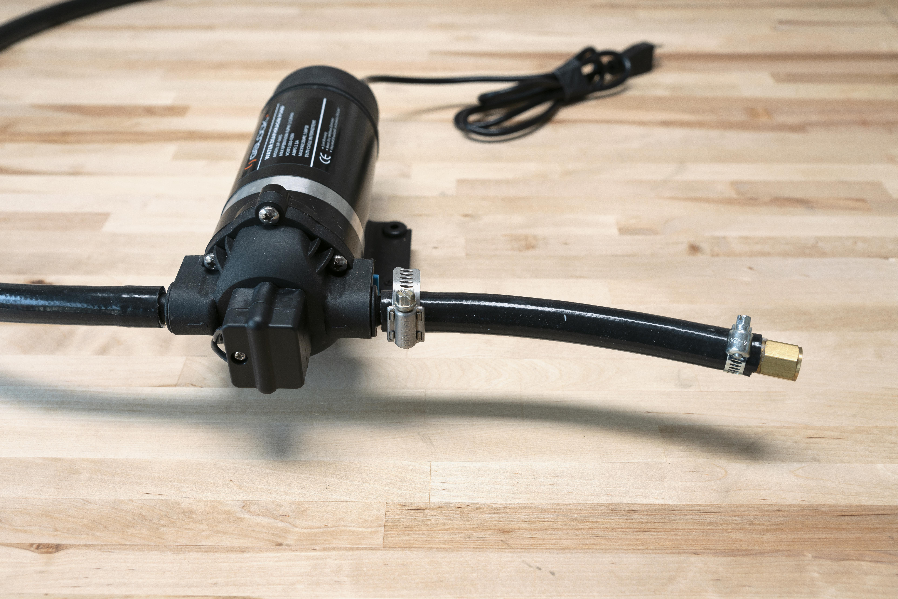

 3. Install a push-connect tube fitting into the female threaded end of the barb fitting. Use teflon tape to form a good seal, and tighten with wrenches.

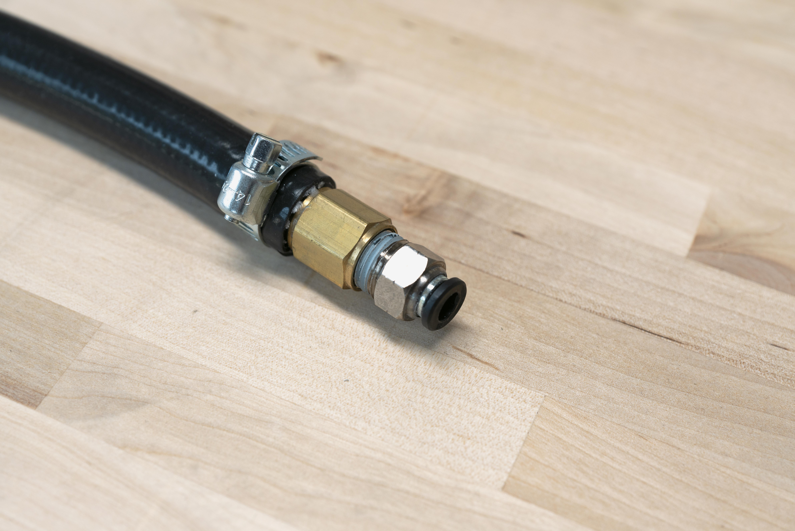

 4. Cut a short length of the plastic tubing. Push one end into the push-connect fitting. Push the other end into the inlet end of the manual shut-off valve. Give each connection a tug to make sure everything is seated well.

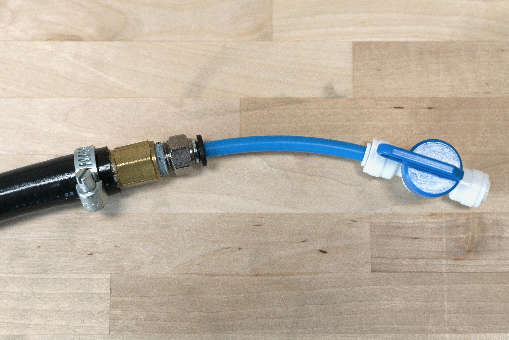

 5. Cut another length of tubing, and run it from the manual shut-off valve to the inlet of the water filter.

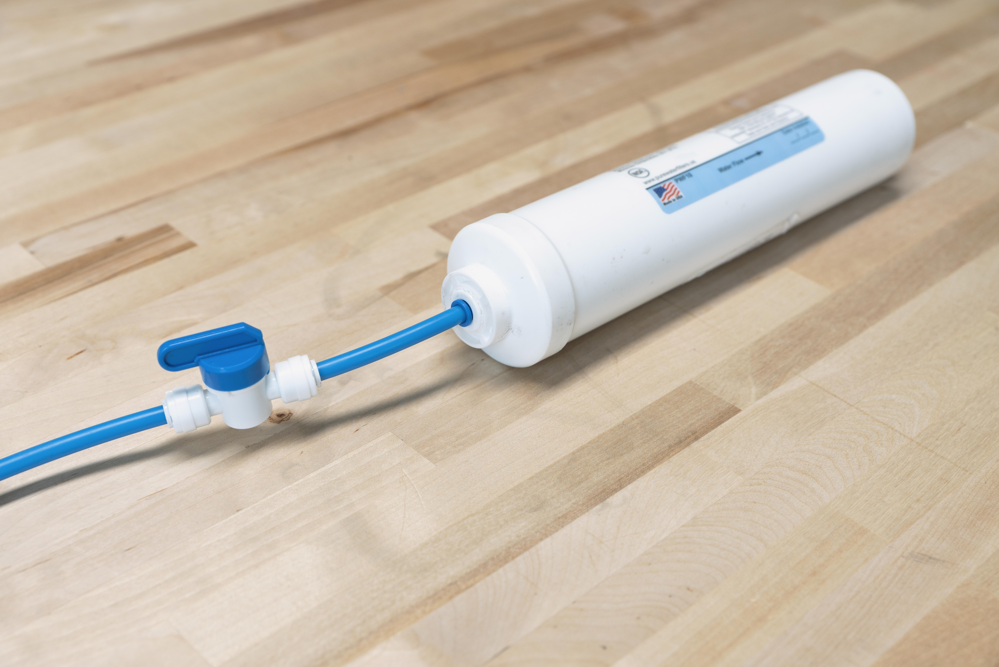

 6. Cut a length of tubing to run from the water filter to the electric valve. The inlet side of the electric valve is labelled “2”.

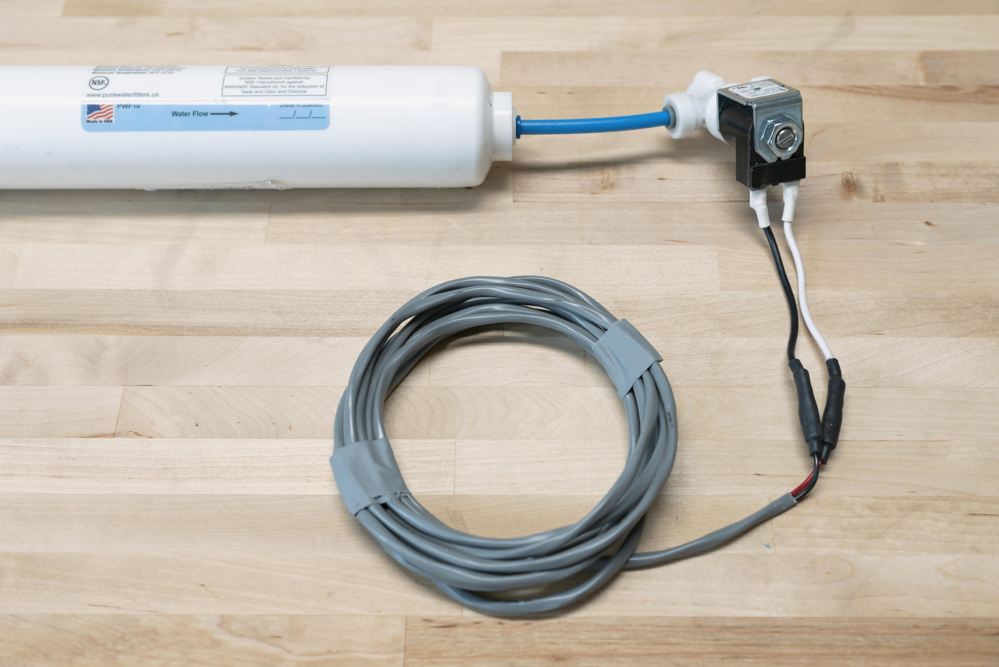

 7. Install three push-connect fittings into the brass Tee junction and tighten with wrenches to ensure a good seal.

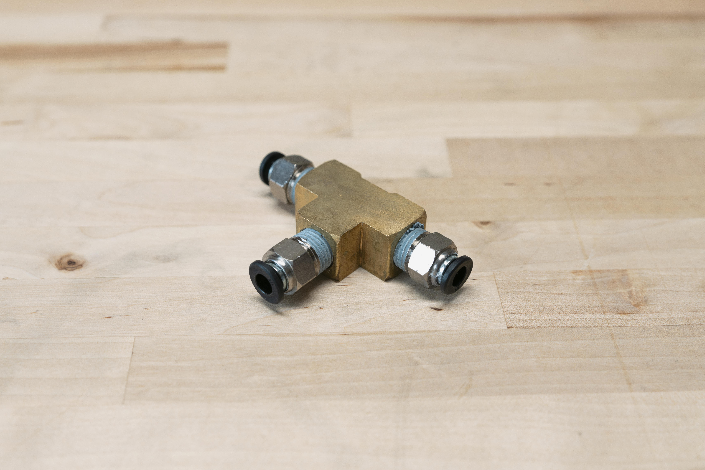

 8. Run a short length of tubing from the output of the electric valve (labelled “1”) to the tee junction.


 9. Install one push-connect fitting and one thread reducer into a brass elbow junction. Tighten with wrenches to ensure a good seal. Repeat with both elbow junctions.

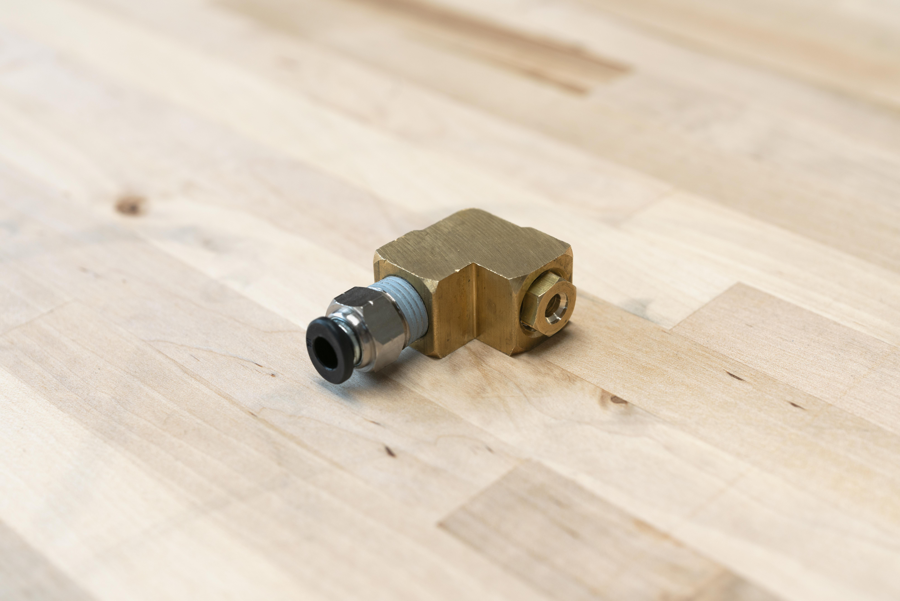

 10. Thread a mister nozzle into each elbow assembly.

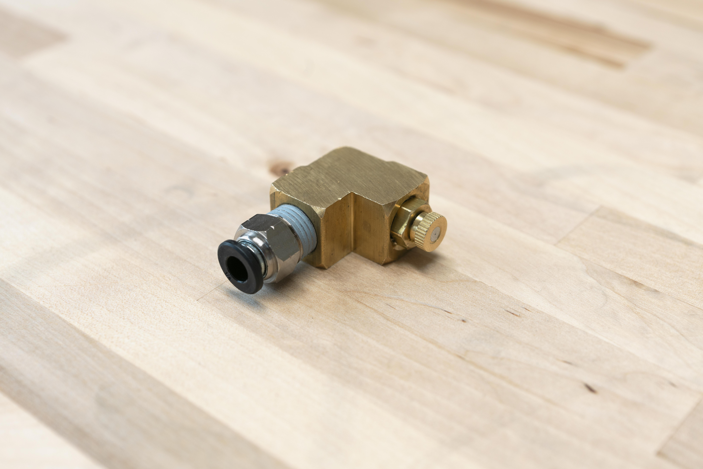

 11. Cut two lengths of tubing, to run from the Tee junction to each nozzle/elbow assembly.


### Step 2: Priming the Pump
 1. Fill the water bucket and drop the inlet hose down to the bottom of the bucket.
 2. Temporarily remove the tubing where it goes into the electric valve, and place this end into a jar to collect water during the priming process.
 3. Open the manual shut-off valve.
 4. Plug in the water pump. Water will gush out into the jar in an uneven stream, with bubbles.
 5. Wait for the bubbles to turn into a continuous, solid stream of water. This should take only a few seconds. Once the stream looks good, close the manual shut-off valve.
 6. With the manual shut-off valve closed, the pump should get to pressure and turn off within a few seconds. If the pump does not turn off, check for air or water leaks at the intake or outlet connections.
 7. Now that the system is primed and stable, it is a good time to check for leaks. Dry off any spilled water, and then wait for a few minutes. If any water appears, check the nearest seal.
 8. Now, re-attach the tubing to the electric valve. Open the manual shut-off valve and check for leaks again.
 9. At this point, the pump is primed. We recommend leak testing the downstream seals and the mister nozzles. To do so, close the manual shut-off valve, bypass the electric valve, and re-open the manual shut-off valve to supply pressure to the downstream system.
 10. Seal any leaks and test again.


### Step 3: Electrical Wiring
Note - we mounted all the electronics in the top of our planter to keep them high and dry in case of water leaks.

 1. Solder up the relay kits to make 4 complete boards.

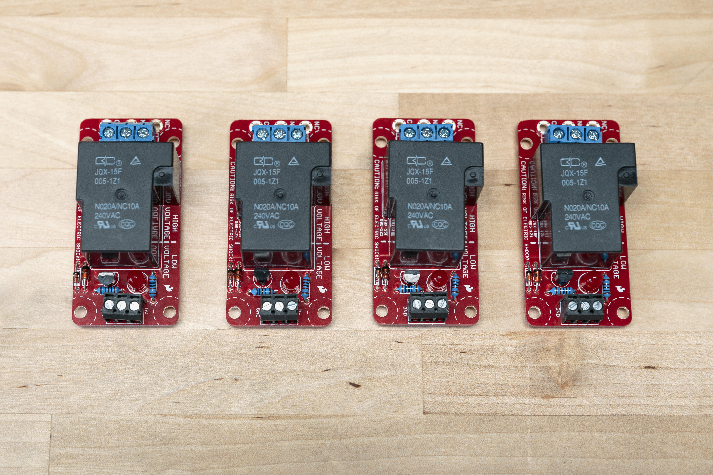

 2. Flash the SD card with [Raspbian](https://www.raspberrypi.org/downloads/noobs/), and put it in the Raspberry Pi.

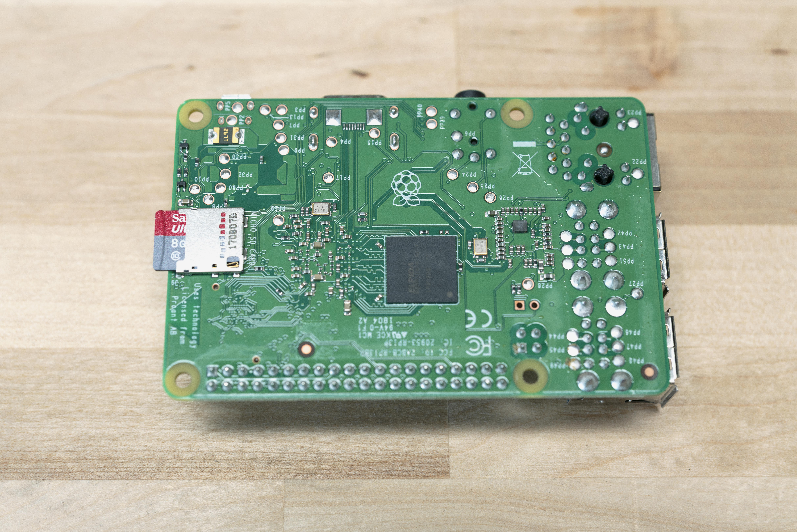

 3. Assemble the plastic case on the Pi.

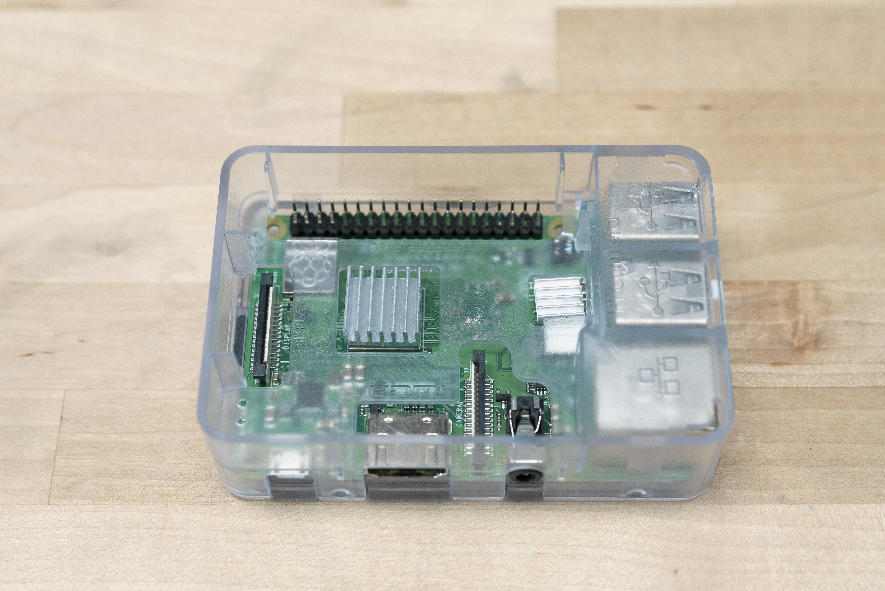

 4. Mount the Pi and relays. We mounted ours onto the inside of our plywood box, but any location is suitable.

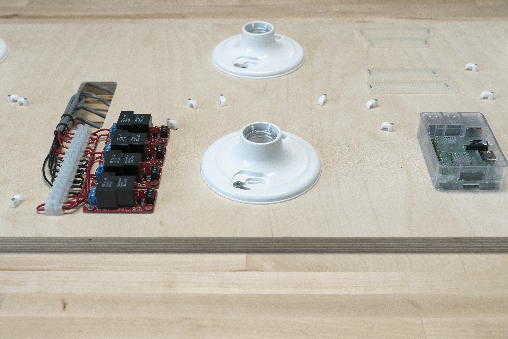

 5. Use the 22AWG wire to connect the Pi’s GPIO pins to the relays according to the following wiring diagram.

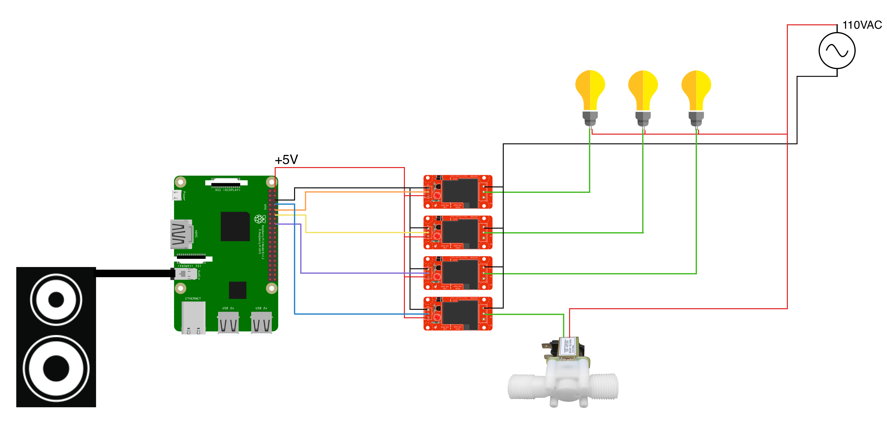

 6. Test-fit the light bulb sockets in the desired locations.


 7. Cut the extension cord in half. Separate the two conductors at the end, and strip the insulation back ⅛”.


 8. Use the extension cord, terminal strips, and 16AWG wire to connect three of the relays to the light bulb sockets, according to the wiring diagram above.


 9. Use more 16AWG wire to connect the electric valve to the fourth relay, according to the diagram. Carefully seal any electrical connections that may come in contact with water in case of a leak.

 10. Finally, install the USB speakers and plug into the Raspberry Pi.

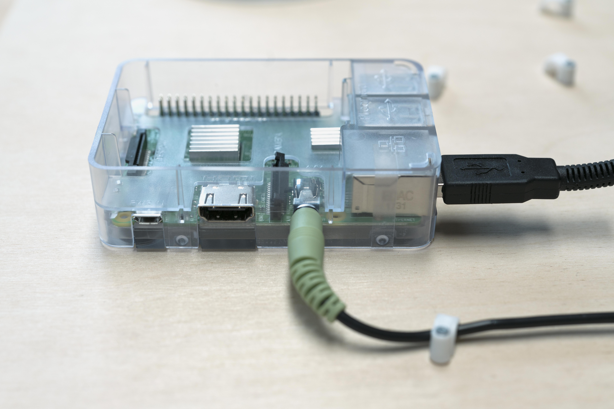


### Step 4: Planter Case
We built our planter case from two plywood boxes and a welded frame. Design files are attached for these boxes, but feel free to build or design your own.
[ picture - CAD ]
[ link to attached files ]

 1. Our lower box holds the pump, filter, and valve. It also cradles the three plastic bins.

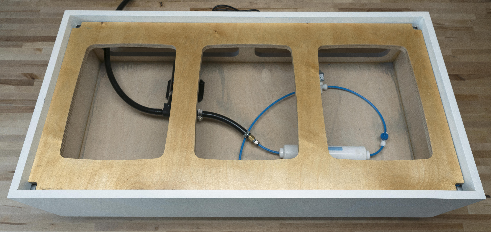

 2. Our upper box holds the lights, relays, speakers, and Raspberry Pi.


 3. We ran our wire cabling through the rear two vertical tubes, and our water piping through the front tubes. The nozzles are mounted in welded fittings on the front tubes.

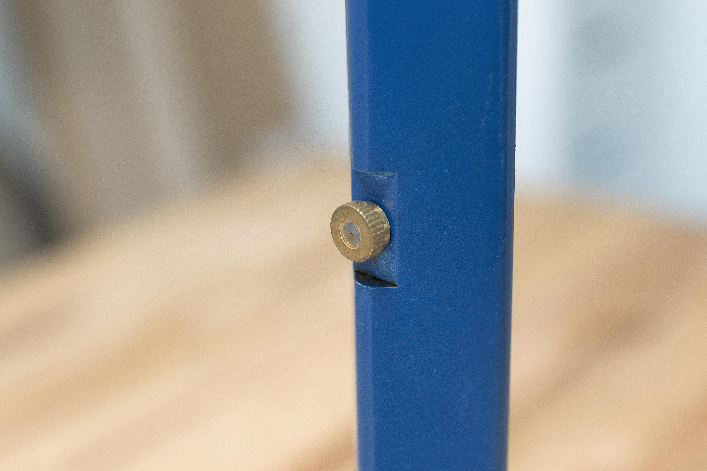


## Building the Mailbox: What You'll Need

### Tools
* Soldering Iron + Solder
* Wire Strippers
* Screwdriver Set
* Wrench Set
* Drill
* Step Drill Bit
* Round file
* Optional - 3D printer, lathe


### Materials

| Part                                                                            | Qty | Total   |
| --------------------------------------------------------------------------------|:----| -------:|
| [ Raspberry Pi 3 CanaKit](https://www.amazon.com/gp/product/B01C6EQNNK/ )       | 1   | $49.99  |
| [ Camera Cable Extension](https://www.adafruit.com/product/1730 )               | 1   | $2.50   |
| [ Pi Camera V2](https://www.adafruit.com/product/3099 )                         | 1   | $29.95  |
| [ Extension Cord](https://www.amazon.com/gp/product/B00178HJ6C/ )               | 1   | $5.79   |
| [ Solderable Breadboard](https://www.adafruit.com/product/1609 )                | 1   | $4.50   |
| [ 22 AWG Wire](https://www.amazon.com/gp/product/B00B4ZQ3L0/ )                  | 1   | $17.95  |
| [ Hall Effect Sensor](https://www.adafruit.com/product/158  )                   | 3   | $6.00   |
| [ Magnet 4mm x 10mm](https://www.amazon.com/gp/product/B076Q63S5R/ )            | 3   | $10.99  |
| [ Photoresistor](https://www.adafruit.com/product/161  )                        | 1   | $0.95   |
| [ Trim Pot 100k](https://www.amazon.com/gp/product/B00GMOICOY/ )                | 1   | $6.58   |
| [ 12V Power Supply](https://www.adafruit.com/product/798  )                     | 1   | $8.95   |
| [ Beefcake Relay](https://www.sparkfun.com/products/13815 )                     | 4   | $31.80  |
| [ LED Strip](https://www.amazon.com/gp/product/B00NHRFAQW/ )                    | 1   | $20.98  |
| [ Stepper Driver](https://www.pololu.com/product/2133 )                         | 1   | $8.95   |
| [ Stepper Motor](https://www.pololu.com/product/1209 )                          | 1   | $15.95  |
| [ Mounting Bracket](https://www.pololu.com/product/2257 )                       | 1   | $2.95   |
| [ GT2 Pulley](https://www.adafruit.com/product/1253 )                           | 1   | $11.95  |
| [ GT2 Belt](https://www.adafruit.com/product/1184 )                             | 1   | $9.95   |
| [ Thrust Bushing - Rulon J](https://www.mcmaster.com/#7488k14/=1cvpp5e  )       | 2   | $11.45  |
| [ Screws - #6-32 Flat Head](https://www.mcmaster.com/#91099a215/=1cvpsa5  )     | 9   | $4.91   |
| [ Acrylic Sheet - 1/4" or 6mm](https://www.amazon.com/gp/product/B00844SOSE/ )  | 1   | $14.99  |
| [ Acrylic Sheet - 1/16" or 1.5mm](https://www.amazon.com/gp/product/B01DYG13DE/ ) | 1 | $8.99   |
| [ Mailbox - Deus Modern Waldo](https://www.deusmodern.com/mailbox-collection/waldo-mailbox ) | 1 | $375.00 |
| [ Mailbox Post - Deus Modern Round](https://www.deusmodern.com/accessories/mailbox-post-3-round ) | 1 | $149.00 |

### Warnings
* This project involves high-voltage wiring (mains 110V). Take appropriate safety precautions when working with mains voltage, and ensure that everything is unplugged before touching electrical connections.
* This project also involves moderately pressurized water.  Use appropriate sealing strategies on all joints, and always leak-test before installing.
* Most importantly - water and electricity can be dangerous in combination. Plan your electrical layout so there is no possibility of leaking water coming in contact with electrical connections. We suggest a basic layout strategy in the instructions, but use care and common sense to keep yourself safe.


## Mailbox Assembly

### Step 1: Door Switch
 1. Solder three wires to a hall effect sensor with about 50cm length.

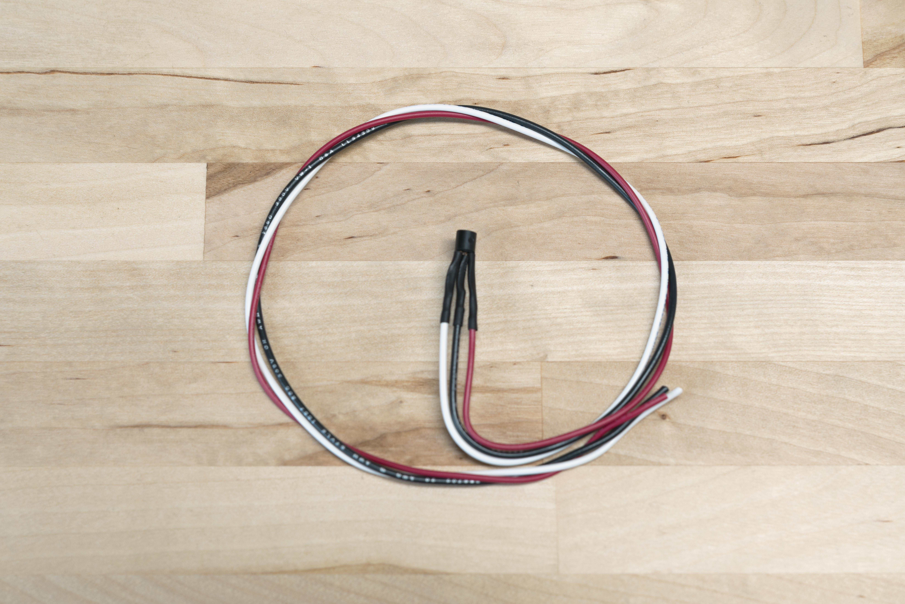

 2. Install a magnet into the door. We drilled a hole and pressed it into our door, next to the magnet that came with the mailbox for holding the door shut.

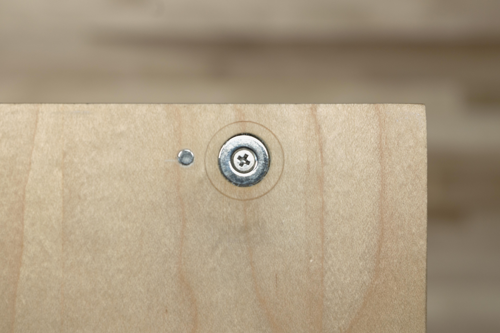

 3. Attach the hall effect sensor so they come into proximity when the door is closed. We hid the hall effect sensor behind the tab at the opening. The magnet should come within a few mm of the flat side of the hall sensor.

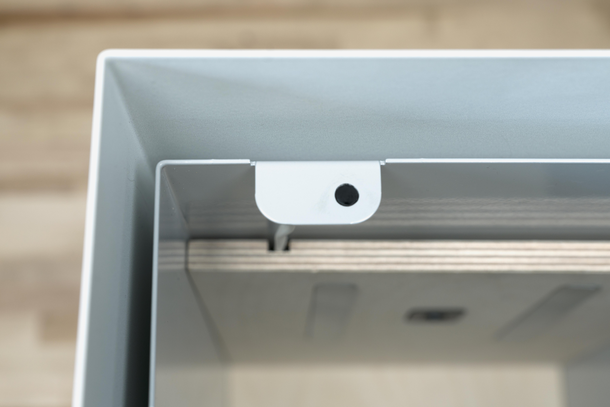


### Step 2: Photocell
 1. Drill a hole in the bottom floor of the mailbox, roughly located in the center. Attach the photocell below this hole so that it is facing up into the mailbox. We covered our photocell with a piece of clear acrylic for weatherproofing.


 2. Solder two wires to the photocell with about 50cm of length. Route these wires towards the back of the mailbox.


### Step 3: LED and Camera
 1. Cut two pieces of LED strip about 20cm long.  Solder two 50cm wires to each LED strip.


 2. Prepare the Raspberry Pi Camera by inserting the extension cable and securing it in the connector.


 3. Install the LED strips and camera into the inside of the mailbox roof. We routed a piece of plywood to fit inside the mailbox - design files are attached, but feel free to do it a different way.

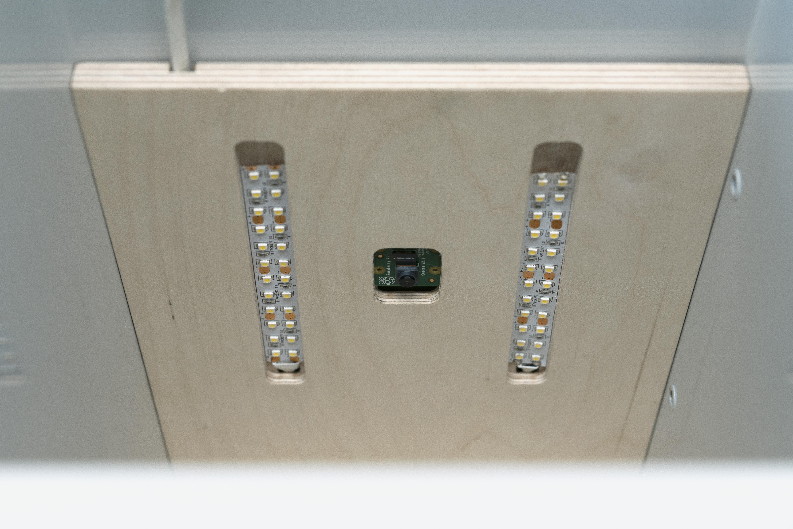

 4. Route all wires towards the back of the mailbox. We also cut acrylic covers to fit over the LED strips and camera, but this is optional.

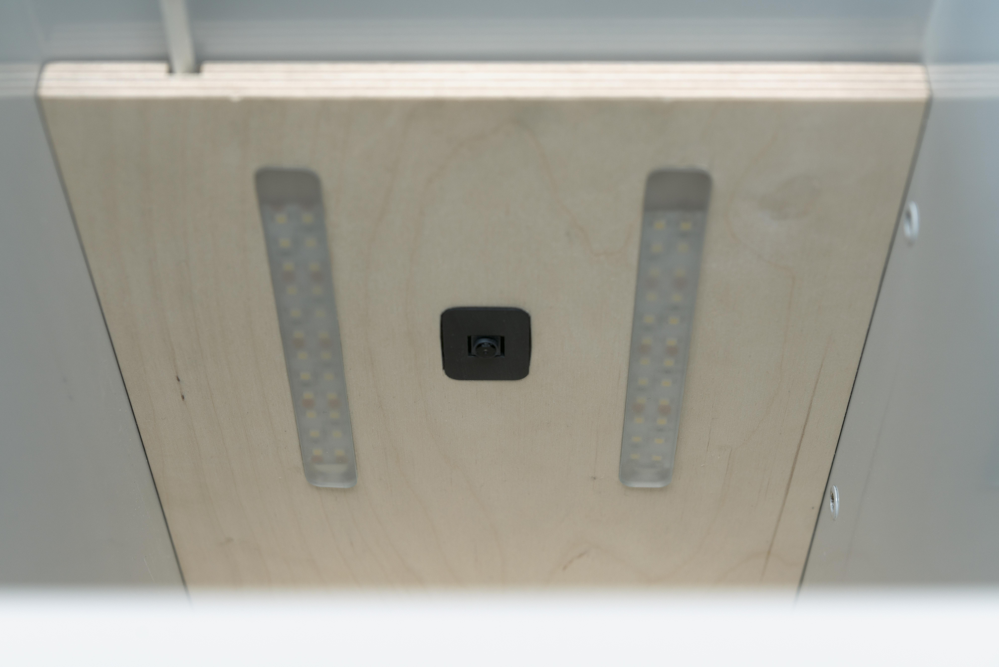


### Step 4: Mailbox Flag
Note: our method of mounting the flag is specific to the Deus Modern Waldo mailbox, which is built with an inner and outer shell. We’ll show you how we built our flag, but feel free to adapt this method to suit your mailbox.

 1. You’ll need some sort of ¾” diameter shaft to pass through the wall of the mailbox. We turned down a part on the lathe, but this could also be 3D printed. A full CAD model for this part is attached.


[ link to CAD model ]

 2. You’ll also want to make a flag. We laser-cut ours from acrylic. Design files are attached.


[ link to DXF files ]

 3. Inside the wall of the mailbox, we laser-cut a large pulley to turn the flag. DXF files are attached. The middle piece is cut from ¼” acrylic, and the other three pieces are cut from 1/16” acrylic.


 4. Test-fit your flag, shaft, bushings, and pulley. We cut a lip into our thrust bushings so they would sit flush and sandwich the side of the mailbox.

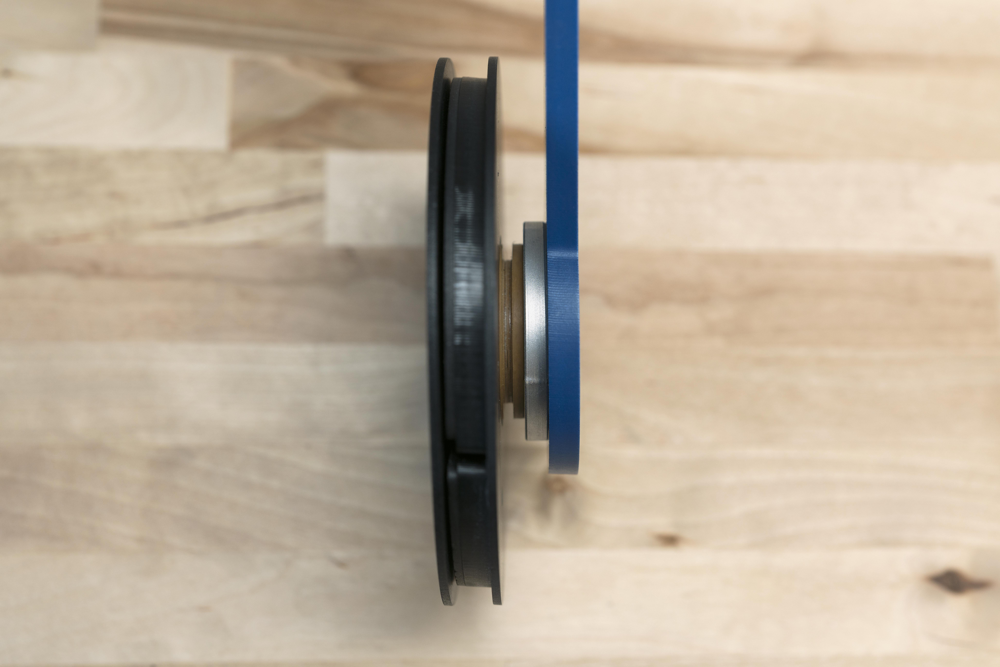

 5. Drill a hole in the outer shell of the mailbox where you’d like the pivot. Debur or file any rough edges.


 6. Install the mechanism into the side of the mailbox.

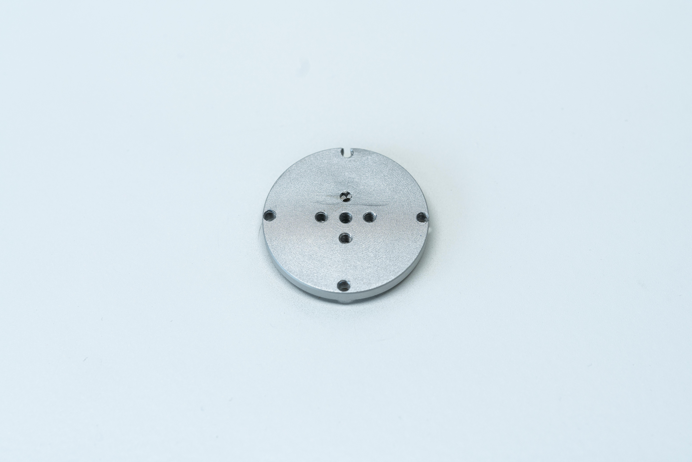

 7. At this point, the flag should turn smoothly within the bushings. Glue two pieces of scrap material to the inside of the wall to create your hard stops.

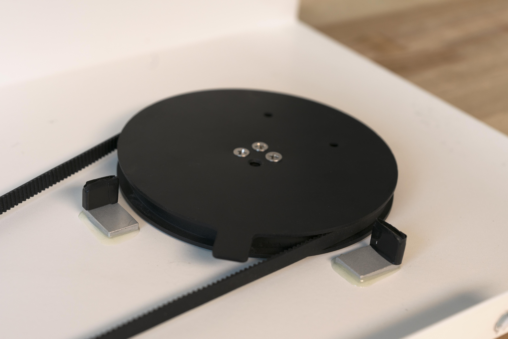

 8. Drill a hole in the side of the inner shell, towards the back of the mailbox, for your stepper motor shaft. The motor will live inside the mailbox, but the pulleys and belting are between the inner and outer walls.


 9. Run the belting from the small GT2 pulley to the large pulley, and cut to length. Fold over the ends and slot them into the large pulley as shown, and secure with the end plat.

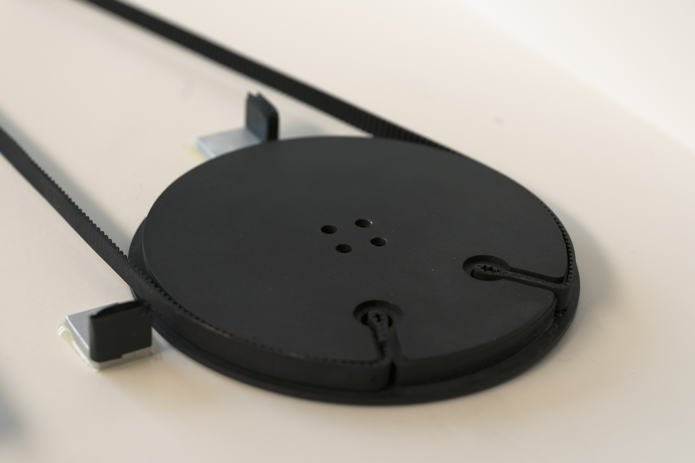

 10. Add your magnets and hall sensors. We attached our magnets to the belt using 3D printed clips (design files attached), but feel free to use your own method. Limit switches would also be good alternative, and can be integrated with your hard stops.

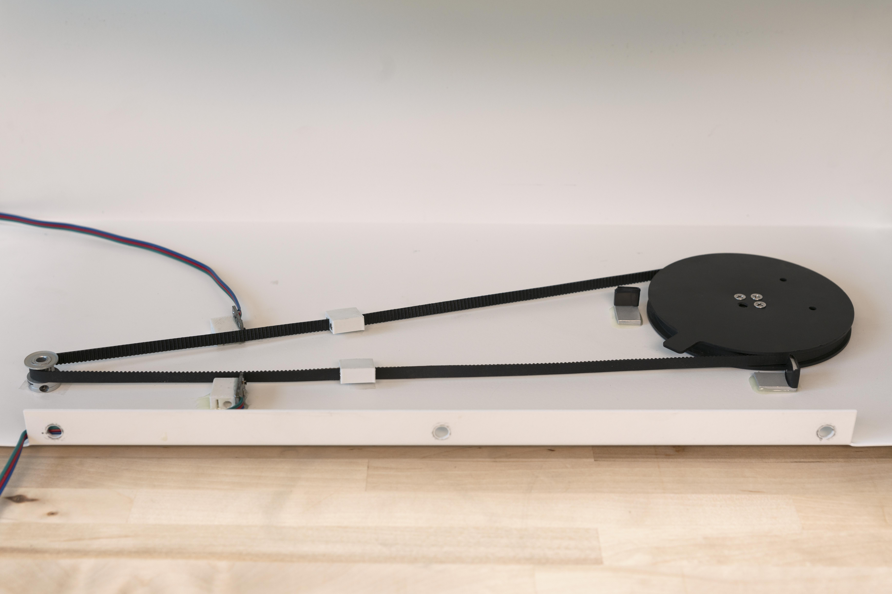


### Step 5: Electrical Wiring
Note - we mounted all the electronics in the back of the mailbox, and hid them with a false wall.

 1. Solder up the relay kit to make one complete relay board.

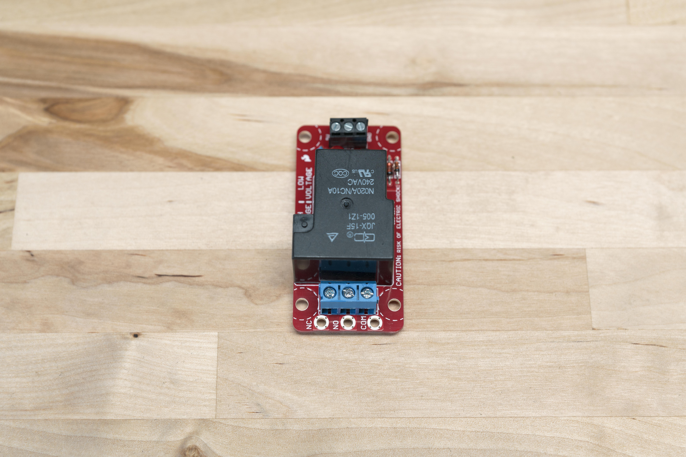

 2. Flash the SD card with Raspbian, and put it in the Raspberry Pi. https://www.raspberrypi.org/downloads/noobs/

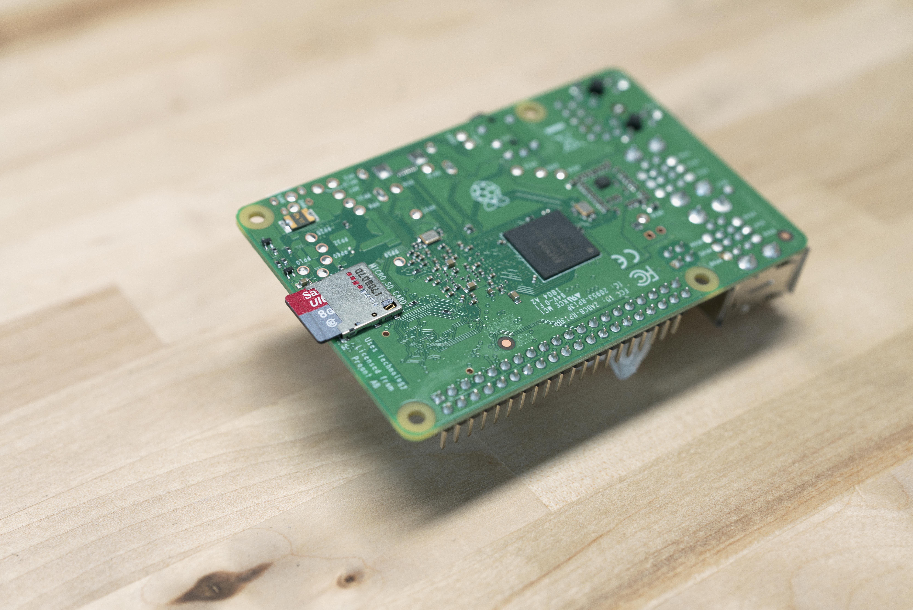

 3. Assemble the plastic case on the Pi.


 4. Mount the Pi and relay. Here, ours are shown mounted onto the back of the false wall, in the back section of the mailbox.

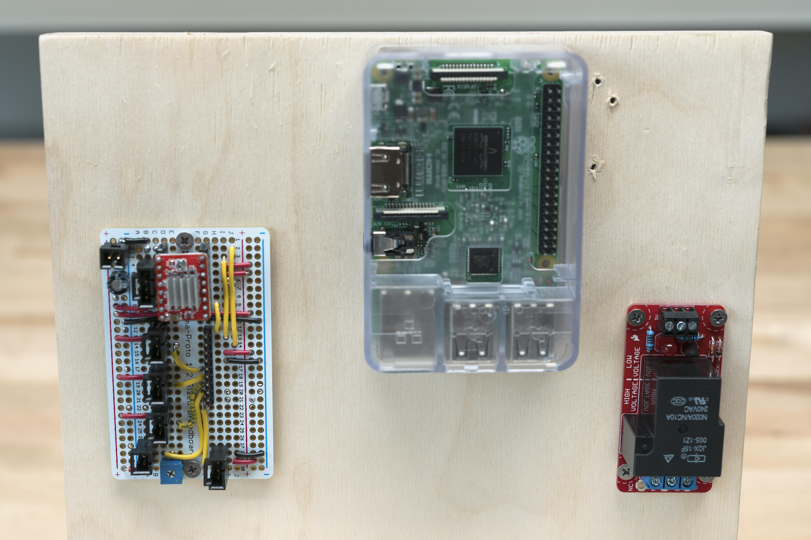

 5. Drill holes to route all wires into this hidden compartment. Include a hole in the bottom for your two power supplies.

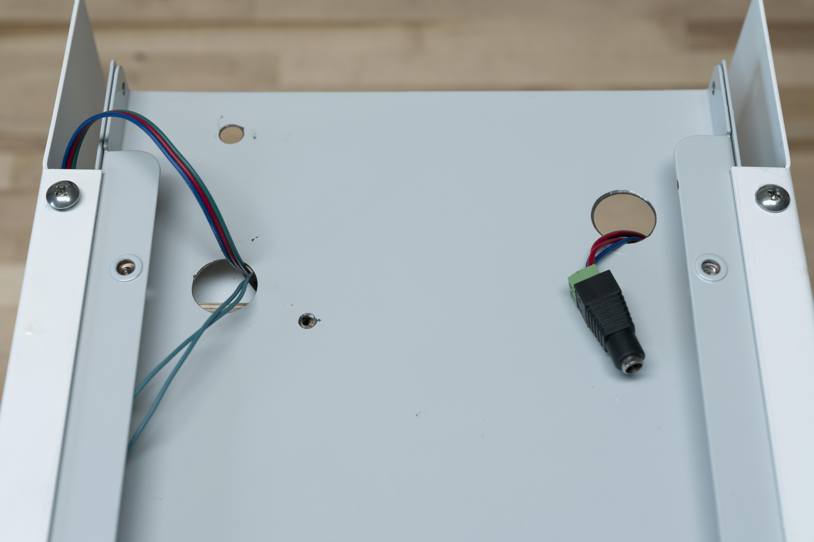

 6. Follow the schematic below to connect all of your hall sensors, stepper motor driver, photocell, trim pot and relay.  We recommend soldering everything using the 22AWG wire and perma-proto board.

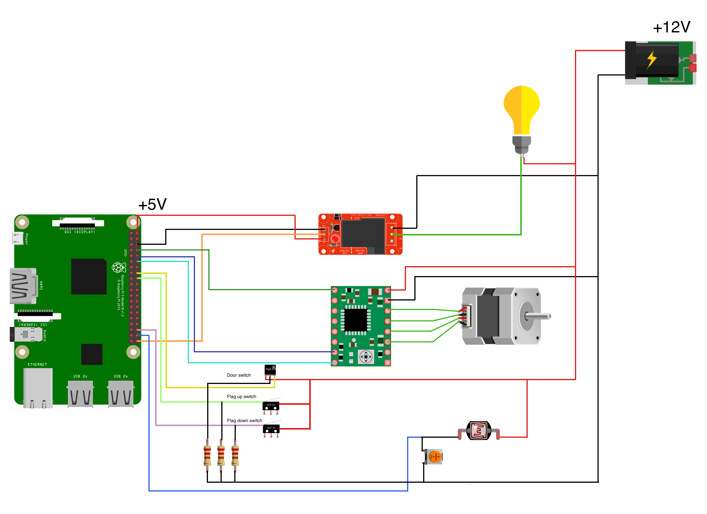


## Smart Home Programming Overview: How do we control a mailbox and planter Assistant Services and the Home Graph API?
* A user adds our custom Smart Home app to their list of Home Control apps in the Google Home app.
* The user makes a request to a Google Assistant powered device like "Set my planter brightness to 85%".
* The Home Graph API notifies the Provider Service that a request has been made for planter brightness to be 85%.
* The Provider Service finds the users planter device (running on a raspberry pi) and sends it an appropriate websocket request.
* The raspberry pi running the planter set the correct GPIOs to on, triggering the relays that run the lights.
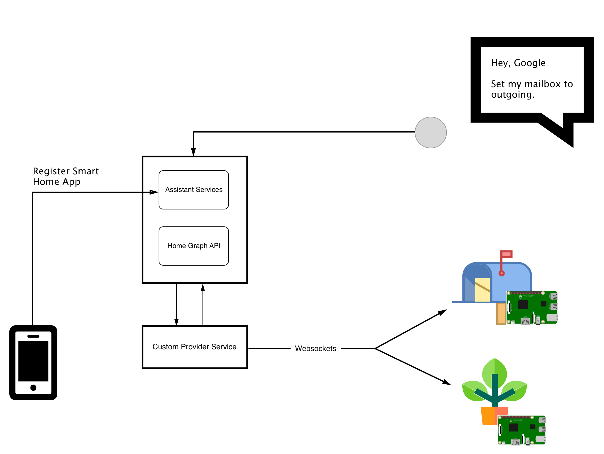


### Step 1: Create an Actions on Google Developer Project
  1. In the [Actions Console](https://console.actions.google.com/u/0/), click Add/Import project
  2. Enter a name for the project and click Create Project
  3. Choose Home Control as your project type
  4. Choose Smart Home as the control experience
  5. Save the project ID in the dashboard for later use
  6. On the left hand side under SETUP, click Invocation
  7. Add your app's name. Click Save.
  8. On the left navigation menu under DEPLOY, click on Directory Information
  9. Add your app info and click Save

### Step 2: Generate a service-account.json file
  1. From your actions project dashboard, click the settings cog and select _Permissions_
  2. In the left hand menu, select _Service Accounts_ and _+Create Service Account_
  3. Give the account a name, a Role of _Owner_ and have it _Furnish a new private key_
  4. Click _Save_ and copy the service-account.json file into the provider_server directory of the project

### Step 3: Tell Google where it should forward provider requests (SYNC, QUERY, EXEC)
  1. Navigate to the [Google Cloud Console API Manager](https://console.developers.google.com/apis)
  2. Enable the [Home Graph API](https://console.cloud.google.com/apis/api/homegraph.googleapis.com/overview)
  3. On your project dashboard, navigate to Credentials
  4. Copy the 'Key' column value for the 'Api Key' entry
  5. Paste that key into the cloud/config-provider.js as the 'Config.smartHomeProviderApiKey' value
  6. In cloud/config-provider.js, replace the existing values for 'smartHomeProviderGoogleClientId' and 'smartHomeProvideGoogleClientSecret' with your own unique values
  7. On your project dashboard, under Build --> Actions, click on the actions.devices action and enter your fulfillment url. This will be {the endpoint where you're hosting the project}/smarthome (e.g. https://smarthome-exampleproject.appspot.com/smarthome).
  8. Under Advanced Options --> Account Linking, select Oauth/Authorization Code as the linking type and enter your client information (i.e. the values you entered for 'smartHomeProviderGoogleClientId' and 'smartHomeProvideGoogleClientSecret')
  9. Click Save
  10. Navigate to 'Actions' and click 'Test'

### Step 4: Run the server on a public domain
  1. If you are using Google App Engine, simply run 'gcloud app deploy' under the correct gcloud project
  2. If you are using a server hosted elsewhere, install dependencies by running:
  ```
  npm install
  npm start
  ```

### Step 5: Link your devices by responding to a SYNC request
  1. Make sure you're using a device logged in under the same account as the Google Developer Project
  2. In the Google Home app, in the menu, click Home Control
  3. Click the (+) button and add your [test] app
  4. The provider server should receive a SYNC request and respond with all of the devices in the cloud/devices.js file

### Step 6: Configure the mailbox and planter to point at your provider server
  1. Install an SD card with a Raspian-stretch lite image and clone the smart-home project in the pi user's home directory
  2. Substitute your provider server endpoint for the value PROVIDER_ENDPOINT in mailbox/app.js and planter/app.js
  3. Run npm install and node app.js from with the mailbox and planter directories

### Step 7: Run a test
  1. In the actions console simulator or any Assistant powered device, run the query "turn on my planter lights"
  2. The provider server should get an EXEC request for action.devices.traits.Brightness and the lights should turn on
